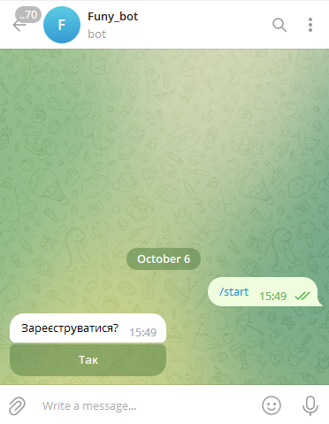
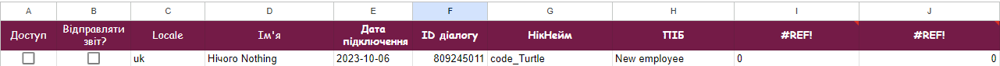
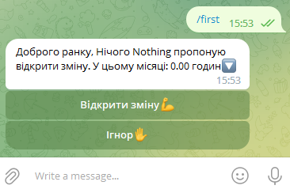
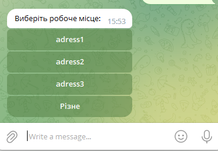
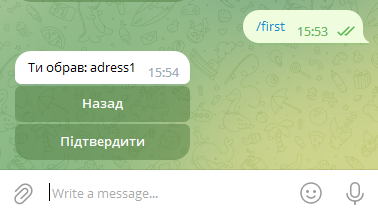
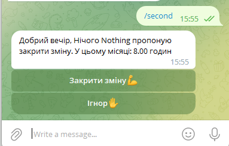
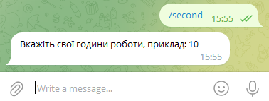
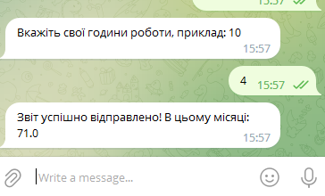
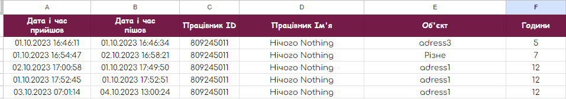
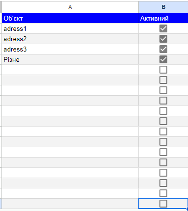

# Telegram bot for tracking employes working hours

This project response twice a day every activ employee.

/start

if you push button yes, your data will spell to google sheet

when owner of table must give access for employee.
After that bot will send request twice a day.

You can call request by hand with next commands:

/first

/second

## Calling reports request by hand

/first

After confirm, you report sending to google sheet:

/second

Second request give you possibility close you work day and send work hours

Close report in google sheet

Adding workplace provide in google sheet

If flag is true - workplace will added do employee request.

## Author

- [@MukhailoK](https://github.com/MukhailoK)

